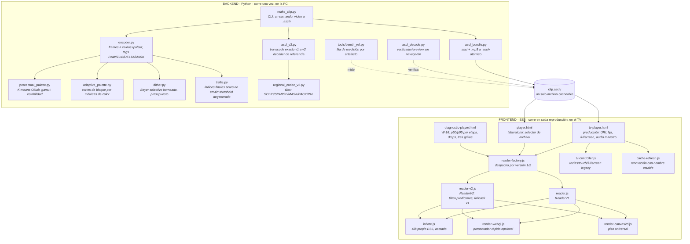
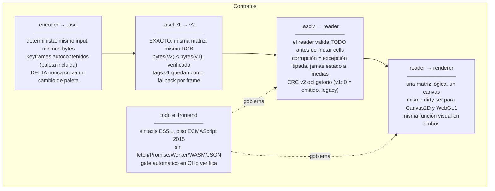
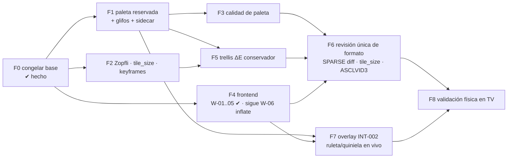

# Mapa del proyecto

Orientación estructural para una sesión nueva: qué compone el sistema, cómo fluye un
video por él, qué contrato cumple cada pieza y en qué orden leer. Los grafos están en
Mermaid y se renderizan en GitHub y en la mayoría de los visores Markdown.

Este documento describe **estructura**, que cambia poco. El estado de avance vive en
[`RUNBOOK-ESTADO.md`](RUNBOOK-ESTADO.md); las tareas, en
[`RUNBOOK-IMPLEMENTACION.md`](RUNBOOK-IMPLEMENTACION.md).

## 1. La idea en una frase

Un video se convierte **offline** (Python, sin límite de CPU) en una grilla de celdas
indexadas a paleta —formato propio `.ascl`, empaquetado con su MP3 como un único
`.asclv` cacheable— que un player **ES5 sin dependencias** reproduce en Smart TVs
antiguos con el mínimo trabajo posible: el TV nunca cuantiza, nunca decide, solo ejecuta
la representación ya elegida.

Todo el proyecto se deriva de esa asimetría: **encoder caro, decoder trivial**.

## 2. Composición



Regla estructural que el grafo no muestra: **ninguna flecha cruza de TV a OFFLINE.**
El frontend jamás necesita Python, Node, red de vuelta ni cómputo del servidor.

## 3. Flujo de un video, de punta a punta

```mermaid
flowchart LR
    subgraph E["encode (una vez)"]
        direction TB
        A[video fuente] --> B[muestreo de frames<br/>fps exactos, sample-and-hold]
        B --> C[paleta<br/>global / block / adaptive / per-frame<br/>median-cut / octree / kmeans-rgb / kmeans-oklab]
        C --> D[cuantización a índices]
        D --> D2[dither selectivo horneado<br/>solo si mejora y cabe en presupuesto]
        D2 --> E1[elección por bytes reales<br/>RAW vs ZLIB vs DELTA vs DELTA_MASK]
        E1 --> F1[.ascl v1]
        F1 --> G[transcode v2 opt-in<br/>tiles/predictores solo si son<br/>lossless Y estrictamente menores]
        G --> H[bundle con MP3<br/>.asclv]
    end
    subgraph P["playback (cada vez)"]
        direction TB
        I[XHR completo<br/>sin streaming] --> J[factory: v1 o v2]
        J --> K[seek dirigido por<br/>audio.currentTime<br/>el audio es el reloj maestro]
        K --> L[decode a matriz cells<br/>validar TODO antes de mutar]
        L --> M[dirty set:<br/>celdas exactas + tiles + full]
        M --> N[conversión RGBA<br/>solo lo sucio]
        N --> O[WebGL1, o Canvas2D<br/>si falla o no existe]
    end
    H --> I
```



## 4. Contratos entre piezas

Lo que cada frontera **garantiza**. Romper uno de estos es romper el proyecto aunque
todos los tests pasen.



## 5. El formato en dos niveles

```text
clip.asclv                          ── envelope ASCLVID1/2: 16 B, dos longitudes
├── video.ascl                      ── header 32 B + tabla de offsets + frames
│   ├── header: magic, versión, modo, flags, fps, grilla, paleta, CRC
│   ├── offsets: uint32 contiguos, un frame por entrada
│   └── frame: block_len + tag + pal_count + [paleta] + payload
│       ├── v1: RAW | ZLIB | DELTA | DELTA_MASK          (tags 0-3)
│       └── v2: + regionales (4-7) y predictores (8-9)
│            └── stream regional: SKIP_RUN SOLID SPARSE MASK PACK1 PACK2 PAL4 PAL8
│                (tiles de 16, LEB128 canónico, validación transaccional)
└── audio.mp3                       ── tal cual; el navegador lo decodifica
```

La spec normativa es `ASCL-format-spec.md`. Regla de oro del formato: **canonicidad
forzada** — uvarint no canónico, padding distinto de cero, offsets no crecientes o
cambios nulos se **rechazan**, no se toleran.

## 6. Qué está en obra (resumen; el detalle vive en el ESTADO)



La feature nueva grande es la **intervención matricial** (`DISENO-INTERVENCION-MATRICIAL.md`):
resultados en vivo escritos como índices sobre la matriz, con 10 entradas de paleta
reservadas (`246..255`, la 255 transparente), glifos de dígitos horneados, y un canal de
datos de ~50 bytes con serial monotónico. Un solo layer siempre.

## 7. Invariantes que ninguna sesión puede violar

1. Un `.asclv` = un recurso cacheable. Sin streaming, sin segundos archivos en runtime
   (el sidecar de slots es transitorio hasta `ASCLVID3`).
2. Todo lo perceptual (Oklab, K-means, dither, detección de cortes) ocurre **offline**.
3. Canvas2D es el piso; WebGL1 solo acelera, nunca agrega función.
4. Ningún buffer nuevo proporcional al frame por cuadro en el loop estable.
5. Los valores manuales del operador (cols, fps, colores) prevalecen sobre cualquier
   perfil o automatismo. No hay IA ni selector visual en el pipeline.
6. Una mejora sin medición registrada no existe. La fila de `bench_ref.py` es el hecho;
   la impresión visual es anecdota.
7. El decoder confía en cero campos: valida antes de usar, siempre, aunque el encoder
   propio sea el único emisor conocido.

## 8. Orden de lectura para una sesión nueva

| Paso | Documento | Para qué |
|---|---|---|
| 1 | este mapa | estructura y contratos |
| 2 | `RUNBOOK-ESTADO.md` | dónde quedó todo, próxima acción, bitácora de desvíos |
| 3 | `RUNBOOK-IMPLEMENTACION.md` | la tarea a ejecutar, con archivo, línea y cierre |
| 4 | `PLAN-UNIFICADO-TIERS-E-INTERVENCION.md` | el porqué del orden (colisiones C-1..C-8) |
| 5 | `DISENO-INTERVENCION-MATRICIAL.md` | solo si la tarea toca overlay/paleta reservada |
| 6 | `ASCL-format-spec.md` | solo si la tarea toca bytes del formato |

Regla de arranque: verificar la procedencia del código (tabla en el ESTADO), correr
`python tests/run_all.py` **antes** de tocar nada, y localizar referencias por nombre de
función — los números de línea del runbook corresponden al árbol del 2026-08-27.
